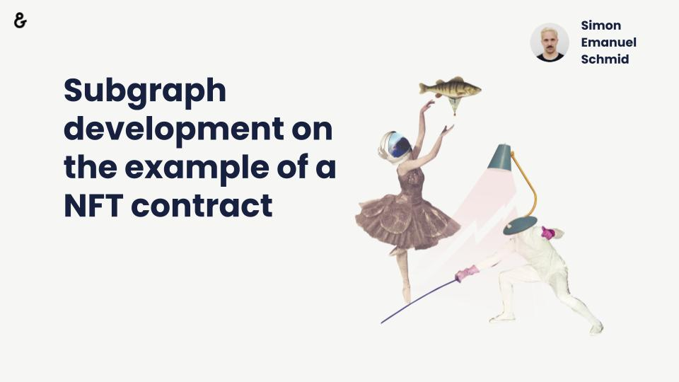

- Contract to index: https://etherscan.io/address/0xc2c747e0f7004f9e8817db2ca4997657a7746928
- [Google Slides](https://docs.google.com/presentation/d/1braNq81WswM31CwMEyL4mKl-BqtnwzED5iFlDftShDA/edit?usp=sharing)

# NFT Subgraph Example with Open Zeppelin

## Prerequisites

- Install graph-cli

## Steps

- `yarn add @openzeppelin/subgraphs @graphprotocol/graph-ts @graphprotocol/graph-cli`
- [Find the contract on Etherscan](https://etherscan.io/address/0xc2c747e0f7004f9e8817db2ca4997657a7746928)
- [Find the contract creation transaction for startBlock](https://etherscan.io/tx/0xe9e60dc12e1a7bc545aa497bc494f5f54ce81da06de4f6fef50459816218e66b)
- [Create config.json](./config.json):

```json
{
  "output": "",
  "chain": "mainnet",
  "datasources": [
    {
      "address": "0xc2c747e0f7004f9e8817db2ca4997657a7746928",
      "startBlock": 11743743,
      "module": "erc721"
    }
  ]
}
```

- Run this command:

```bash
npx graph-compiler \
  --config config.json \
  --include node_modules/@openzeppelin/subgraphs/src/datasources \
  --export-schema \
  --export-subgraph
```

- Add scripts to `package.json`:

```json
{
  "scripts": {
    "build": "graph build",
    "codegen": "graph codegen",
    "deploy": "graph deploy"
  }
}
```

- Fix subgraph.yml 🤯:

```
file: node_modules/@openzeppelin/contracts/build/contracts/IERC721Metadata.json
```

- `yarn codegen`
- `yarn build`

- https://thegraph.com/en/
- Go to studio
- Connect with MetaMask
- Create a Subgraph
- `graph auth --studio ...`
- Update scripts:

```json
"deploy": "graph deploy --studio hm-test"
```

- Copy the Temporary Query URL
- Go to https://graphiql-online.com/
- Check the data:

```graphql
query Test {
  erc721Contracts {
    name
    id
    supportsMetadata
    symbol
  }
  erc721Tokens {
    id
    owner {
      id
    }
    uri
  }
}
```

- Publish & signal
- View on Graph Explorer

## Other resources

- https://github.com/itsjerryokolo/CryptoPunks
- https://graphiql-online.com/graphiql
- https://github.com/dabit3/building-a-subgraph-workshop
- https://thegraph.com/docs/developer/quick-start
- https://thegraph.com/discord
